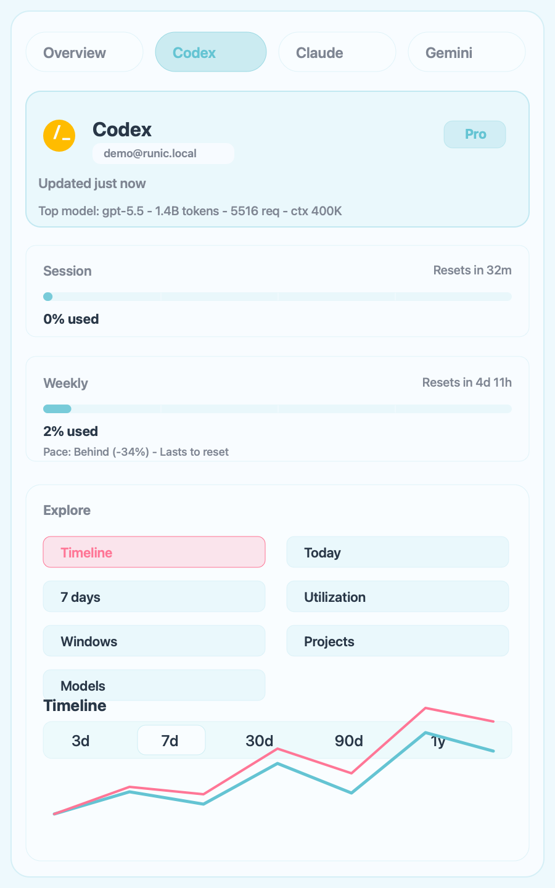
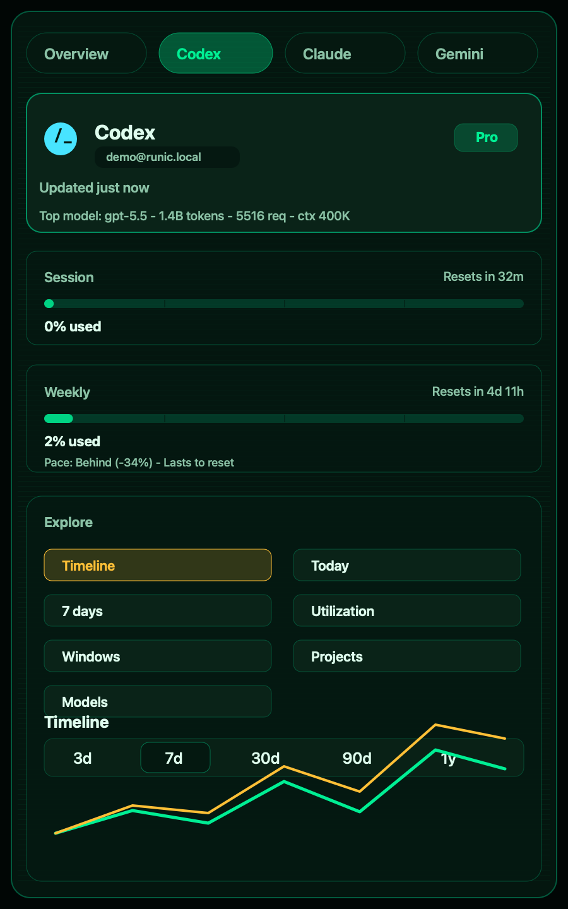
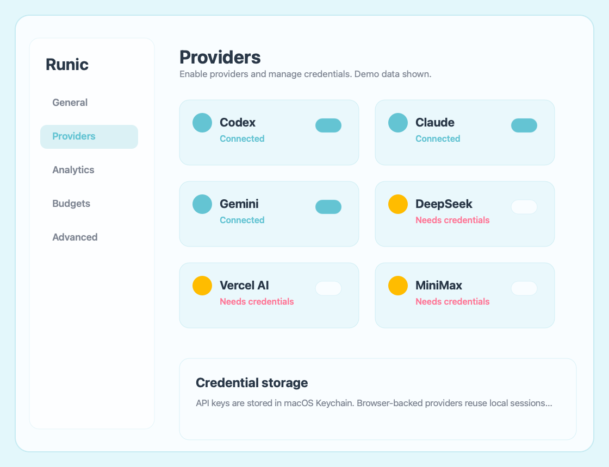
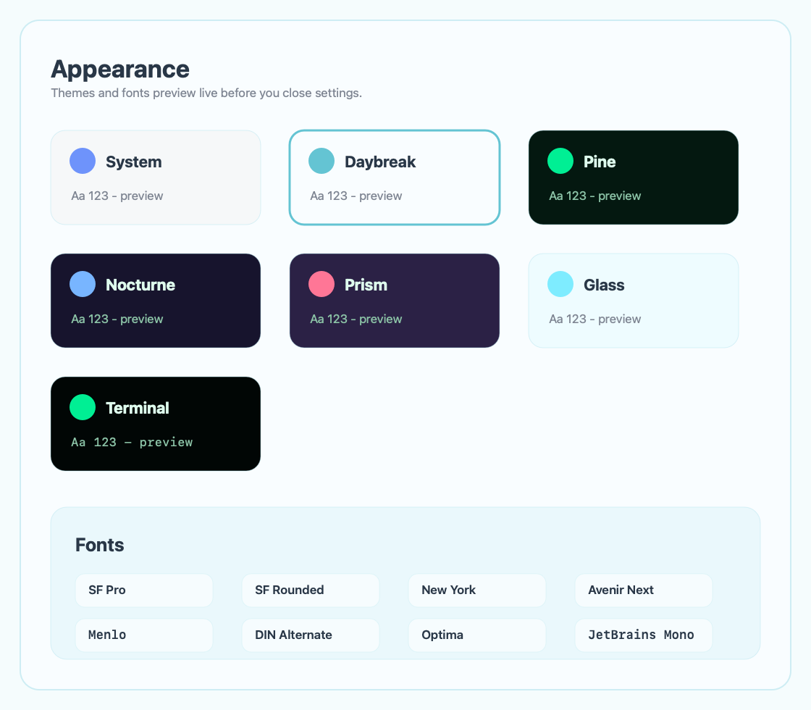

# Runic

<div align="center">


**AI usage monitoring for your Mac menubar.**

Monitor usage, quotas, context labels, and best-effort cost signals across 27 AI providers.


</div>

---

## What it does

Runic sits in your menubar and shows how much of your AI subscription you've used, what it's costing, and when your limits reset. One click gives you charts, breakdowns, forecasts, scoped exports, and provider health across your enabled providers.

## Screenshots

Screenshots below use sanitized demo data.

| Menubar | Terminal Theme |
|---|---|
|  |  |

| Provider Settings | Themes & Fonts |
|---|---|
|  |  |

## Supported Providers

| | | |
|---|---|---|
| Claude (1M ctx) | Codex (400K ctx) | Cursor (128K ctx) |
| Gemini (1M ctx) | Copilot (128K ctx) | z.ai (205K ctx) |
| OpenRouter (ctx varies) | Groq (128K ctx) | DeepSeek (64K ctx) |
| Fireworks (128K ctx) | Mistral (128K ctx) | Perplexity (128K ctx) |
| Kimi (128K ctx) | Together (128K ctx) | Cohere (128K ctx) |
| xAI (128K ctx) | Cerebras (128K ctx) | SambaNova (128K ctx) |
| Azure OpenAI (ctx varies) | Bedrock (ctx varies) | Vertex AI (ctx varies) |
| Qwen (128K ctx) | MiniMax (ctx varies) | Auggie (ctx varies) |
| Antigravity (ctx varies) | Factory (Droid, ctx varies) | Vercel AI (ctx varies) |

Context labels prefer Kosha-discovery 1.2.0's local TTL-backed capability registry at `~/.kosha/registry.json` when it is present. Runic reads that file only as local metadata, marks Kosha model/provider capability data stale after 24 hours, and falls back to `Sources/Runic/Resources/provider-context-windows.json`. Fixed labels describe known model context capacity; `ctx varies` means the selected model or deployment context capacity depends on the hosted model, deployment, or upstream provider.

## Features

**Overview dashboard**
- All providers at a glance with brand icons and progress bars
- Activity ring showing average usage across providers
- Model context capacity, reset countdown, and usage window per provider
- Combined 7-day stacked bar chart

**Per-provider view**
- Hero stat with provider icon, today's token count and cost
- Inline line chart with 1h / 6h / 1d / 7d / 30d range picker
- Glassmorphism stat cards (Peak Hour, This Week) with sparklines
- Usage progress bars with sheen animation and glow effects
- Live "Updated Xs ago" timestamp

**Charts** (submenus)
- Usage timeline (area + line, Catmull-Rom interpolated)
- Today by hour (24-bar chart with peak highlight)
- Last 7 days (weekly bar chart)
- Subscription utilization (Daily / Weekly / Monthly)
- Usage window comparison (dual-line session vs weekly)
- Model breakdown (donut chart)
- Project breakdown (horizontal bar chart)

**Analytics**
- Token usage tracking (input, output, cache)
- Cost estimation with per-model pricing
- Spend forecasting with budget breach detection
- Project and model attribution
- Anomaly detection

**Export & Notifications**
- Export the active panel as CSV or JSON (timeline, hourly, weekly, utilization, windows, projects, or models)
- Budget breach alerts via macOS notifications
- macOS widgets (usage, history, compact, switcher)
- CLI tool (`RunicCLI`)

**Design**
- System, Light, Dark, Daybreak, Pine, Nocturne, Prism, Glass, and Terminal themes
- Liquid UI with glass materials and animated progress bars
- Staggered entrance animations and glass shimmer effects
- Custom font system with live preview and theme-aware contrast rules
- Drop-in font extensibility — add TTF/OTF to `Resources/Fonts`, rebuild, auto-discovered
- Design tokens for typography, colors, spacing, corner radius, animation
- VoiceOver accessible
- Sparkle auto-updates

## Accuracy & Transparency

Runic reports what each provider or local client exposes. Claude and Codex currently provide the richest local usage signals; API providers vary by endpoint, account tier, and whether token usage, cache usage, quota, or model inventory is returned by their APIs.

Context labels are model capacity labels, not proof that every token is still semantically retained in the active conversation. When Kosha-discovery 1.2.0 is available, Runic uses its schema-v1 model/provider registry as the freshest capability source; otherwise it uses built-in static fallbacks. Provider-side summarization or compaction may reduce effective retained context even when the model's maximum window is larger.

Compaction itself can consume tokens when the provider performs it through a model call. Runic counts those tokens when they appear in provider/API/local usage records, but it does not yet label them separately as "compaction tax" or estimate semantic context loss.

Cost and quota numbers are best-effort local calculations from logs, API responses, and pricing tables. When a provider does not expose a metric, Runic avoids inventing precision and falls back to the nearest honest label.

Usage windows and reset countdowns are provider-reported when available. A five-hour session window is published for Claude user plans and may appear in some local client surfaces, but it is not a cross-provider standard; many API providers expose minute/day rate limits, monthly spend caps, or no reset window at all.

## Install

**Download** the latest release from [GitHub Releases](https://github.com/sriinnu/Runic/releases/latest), unzip, and drag `Runic.app` to Applications. Signed and notarized — no Gatekeeper warnings.

**Homebrew Cask:**

```bash
brew install --cask sriinnu/tap/runic
```

**Or build from source:**

```bash
git clone https://github.com/sriinnu/Runic.git
cd Runic
./Scripts/compile_and_run.sh
```

## Configure

Open **Preferences** from the menubar. Each provider has its own settings:

- **API-based** (Groq, Mistral, z.ai, etc.): Paste your API key; provider auto-enables
- **CLI-based** (Claude, Codex): Detected automatically from local CLI
- **Cloud** (Bedrock, Vertex AI): Set environment variables

API keys and locally entered secrets are stored in macOS Keychain. CLI or browser-backed providers still depend on the provider's own local session and may require re-login if that external session expires or mismatches.

## CLI

Runic bundles `RunicCLI` for terminal/script usage:

```bash
runic --provider all --format json --pretty
runic cost --provider claude --format json --pretty
```

Install it from **Preferences → Advanced → Install CLI**. See [docs/cli.md](docs/cli.md) for command details and JSON fields.

## Privacy

Zero telemetry. No analytics. No crash reporting. Runic stores usage data locally and makes network requests only for enabled provider fetches, status/update checks, and optional web-dashboard features.

API keys are stored in macOS Keychain. Browser-backed providers reuse local browser/WebKit sessions where available; Runic does not store provider passwords. Local usage logs and CLI/JSON output can include account identity fields such as email addresses, so redact diagnostics before sharing them publicly.

## For Contributors And Agents

Start with [SKILL.md](SKILL.md), [docs/architecture.md](docs/architecture.md), [docs/provider.md](docs/provider.md), and [docs/providers.md](docs/providers.md). Keep README user-facing and keep auth internals, local paths, research notes, and generated reports out of git.

## License

MIT. See [LICENSE](LICENSE).

---

<div align="center">

Built by [Srinivas Pendela](https://github.com/sriinnu)

</div>
