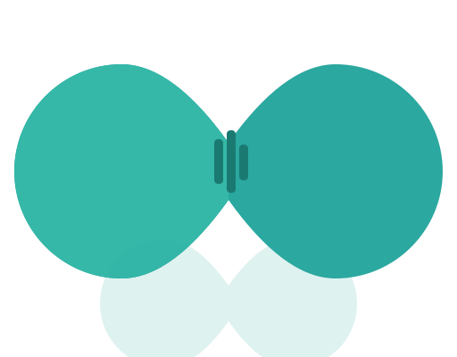

# Runic

<div align="center">



**AI usage monitoring for your Mac menubar.**

Track usage, costs, and quotas across 26 AI providers in real time.


</div>

---

## What it does

Runic sits in your menubar and shows how much of your AI subscription you've used, what it's costing, and when your limits reset. One click gives you charts, breakdowns, and forecasts across all your providers.

## Supported Providers

| | | |
|---|---|---|
| Claude (1M ctx) | Codex (400K ctx) | Cursor (128K ctx) |
| Gemini (1M ctx) | Copilot (128K ctx) | z.ai (205K ctx) |
| OpenRouter | Groq (128K ctx) | DeepSeek (64K ctx) |
| Fireworks (128K ctx) | Mistral (128K ctx) | Perplexity (128K ctx) |
| Kimi (128K ctx) | Together (128K ctx) | Cohere (128K ctx) |
| xAI (128K ctx) | Cerebras (128K ctx) | SambaNova (128K ctx) |
| Azure OpenAI | Bedrock | Vertex AI |
| Qwen (128K ctx) | MiniMax | Auggie |
| Antigravity | Factory (Droid) | |

Context windows are configurable via `Resources/provider-context-windows.json`.

## Features

**Overview dashboard**
- All providers at a glance with brand icons and progress bars
- Activity ring showing average usage across providers
- Context window, reset countdown, and usage window per provider
- Combined 7-day stacked bar chart

**Per-provider view**
- Hero stat with provider icon, today's token count and cost
- Inline line chart with 1h / 6h / 1d / 7d / 30d range picker
- Glassmorphism stat cards (Peak Hour, This Week) with sparklines
- Usage progress bars with sheen animation and glow effects
- Live "Updated Xs ago" timestamp

**Charts** (submenus)
- Usage timeline (area + line, Catmull-Rom interpolated)
- Today by hour (24-bar chart with peak highlight)
- Last 7 days (weekly bar chart)
- Subscription utilization (Daily / Weekly / Monthly)
- Usage window comparison (dual-line session vs weekly)
- Model breakdown (donut chart)
- Project breakdown (horizontal bar chart)

**Analytics**
- Token usage tracking (input, output, cache)
- Cost estimation with per-model pricing
- Spend forecasting with budget breach detection
- Project and model attribution
- Anomaly detection

**Export & Notifications**
- Export as CSV or JSON
- Budget breach alerts via macOS notifications
- macOS widgets (usage, history, compact, switcher)
- CLI tool (`RunicCLI`)

**Design**
- Dark / Light / System theme
- Liquid UI with glass materials and animated progress bars
- Staggered entrance animations and glass shimmer effects
- SF Rounded typography with design tokens
- VoiceOver accessible
- Sparkle auto-updates

## Install

**Download** the latest release from [GitHub Releases](https://github.com/sriinnu/Runic/releases/latest), unzip, and drag `Runic.app` to Applications. Signed and notarized — no Gatekeeper warnings.

**Or build from source:**

```bash
git clone https://github.com/sriinnu/Runic.git
cd Runic
./Scripts/compile_and_run.sh
```

## Configure

Open **Preferences** from the menubar. Each provider has its own settings:

- **API-based** (Groq, Mistral, z.ai, etc.): Paste your API key — provider auto-enables
- **CLI-based** (Claude, Codex): Detected automatically from local CLI
- **Cloud** (Bedrock, Vertex AI): Set environment variables

All tokens stored in macOS Keychain with no password prompts.

## Privacy

Zero telemetry. No analytics. No crash reporting. All data stays on your Mac.

## License

MIT. See [LICENSE](LICENSE).

---

<div align="center">

Built by [Srinivas Pendela](https://github.com/sriinnu)

</div>
